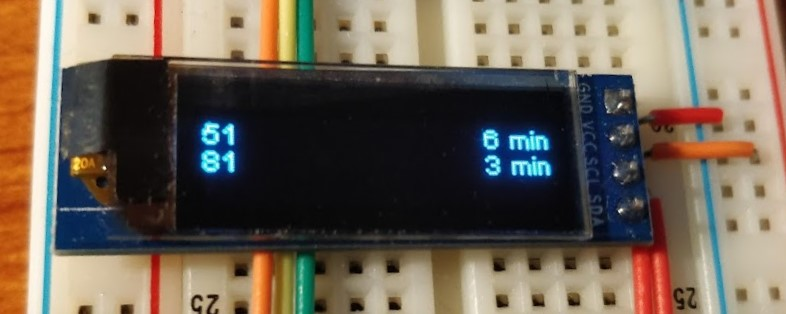
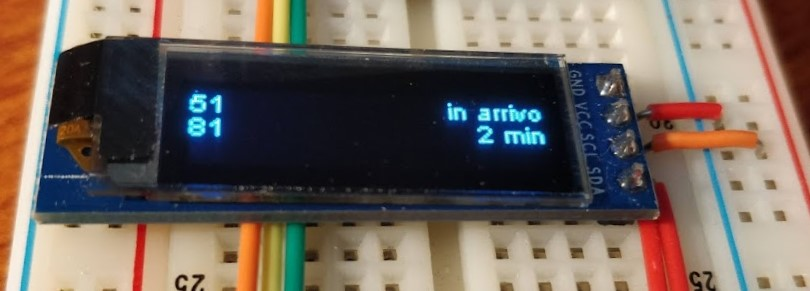
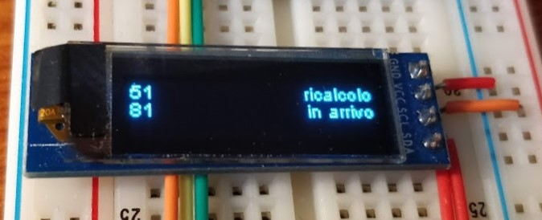
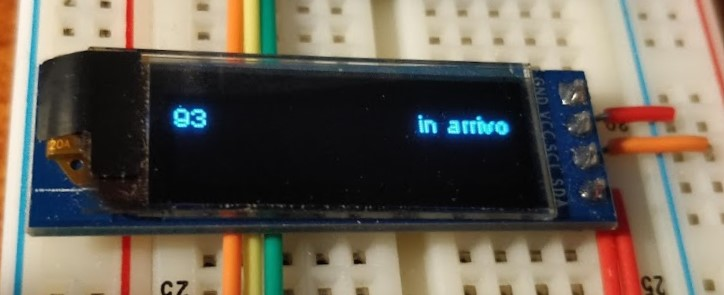

# Pensilina-ATM-IoT

Prendendo ispirazione da [Pensilina-ATM](https://github.com/kristian-keller/Pensilina-ATM), con questo progetto voglio provare a fare una cosa simile ma "fisicamente", con un dispositivo IoT (probabilmente basato su ESP8266)

## Stato attuale

Al momento la funzionalità è limitata alla visualizzazione delle prime tre linee di una fermata (hardcodata), senza lo scorrimento di avvisi sulla terza riga.

## Foto di esempio (non aggiornate alla versione con tre linee)

Sesto Marelli M1:

Via Celoria (Istituto Besta):

